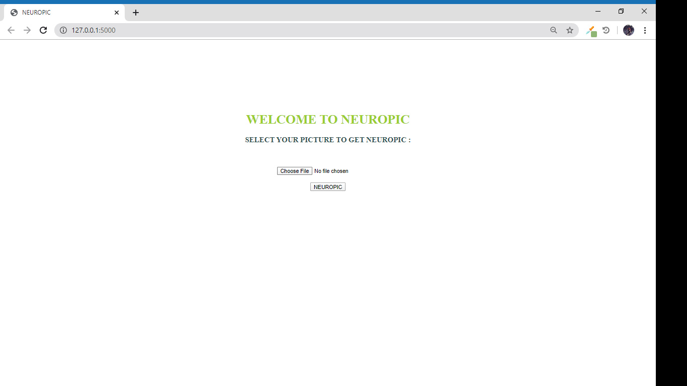
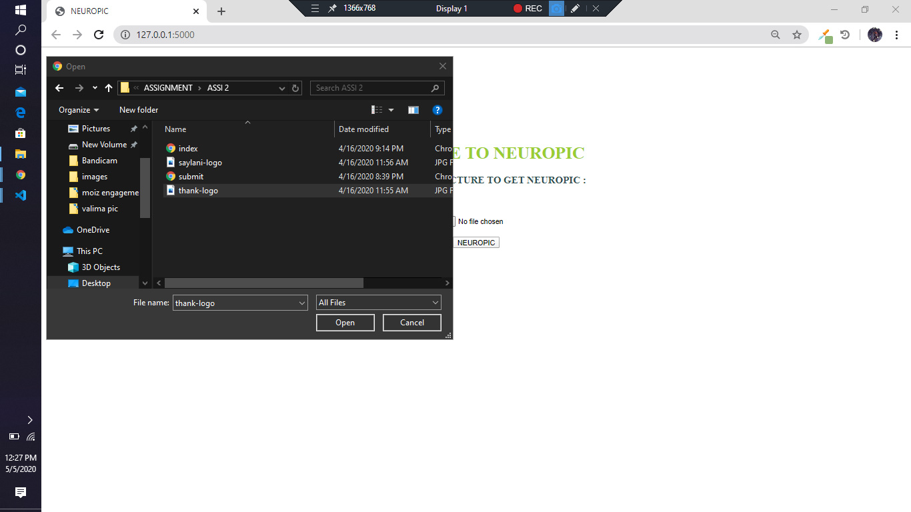
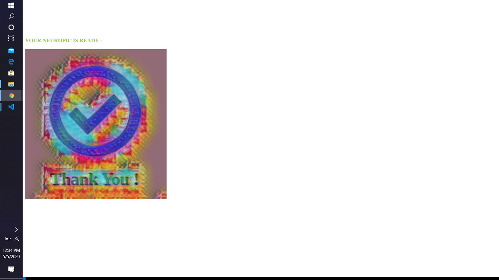

# FLASK-PROJECT
Stuff of flask project

# BOOK_RECOMMENDER-SYSTEM 
Build a Book Recommender System Using PYTHON and FLASK framework.

Written detailed blog on what is recommend system and how to build it.

Detail blog : https://recommendengine.blogspot.com/2020/03/how-to-build-book-recommendation-system.html?m=1

Webpage Link : https://book-recommender.herokuapp.com/

# NEUROPIC

NEUROPIC is the filtered image by using NEURAL STYLE TRANSFER optimization technique. The WEB APP is written in the PYTHON using the FLASK 
WEB FRAMEWORK.

# WEB APP 

## STEP#1
Open the web...

## STEP#2
Select the pic for filter...

## STEP#3
Here is your pic..

